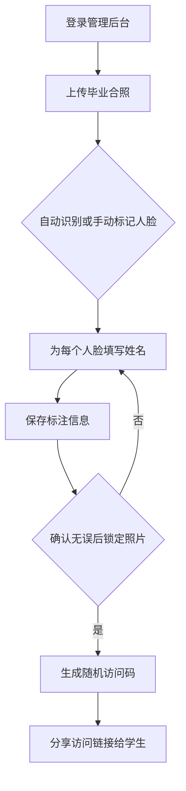
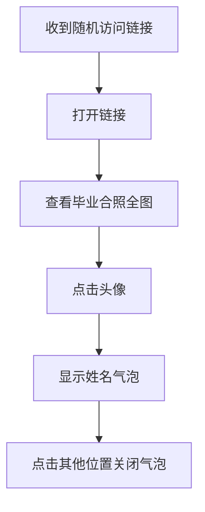

# 毕业合照人脸识别应用 PRD

## 1. 产品概述

一个面向毕业班级的合照管理与展示平台。管理员可以上传毕业合照，识别照片中的人脸并标注姓名，最终生成可分享的私密链接。学生和家长可以通过随机码访问照片，点击头像查看对应姓名，既保留了珍贵的回忆，又保护了个人隐私。

**核心价值**：简化毕业照人脸标注流程，通过随机码实现隐私保护，让每位同学都能找到自己的身影。

## 2. 核心功能

### 2.1 用户角色

| 角色 | 说明 | 核心权限 |
|------|------|----------|
| 管理员 | 老师或班长 | 上传照片、人脸识别、标注姓名、锁定照片、生成访问码 |
| 访客 | 学生、家长等 | 通过随机码查看照片、点击头像查看姓名 |

### 2.2 功能模块

1. **管理后台首页**
   - 照片列表管理
   - 上传新照片
   - 查看未锁定/已锁定照片

2. **人脸标注页面**
   - 显示照片
   - 自动/手动标记人脸位置
   - 为每个人脸框填写姓名
   - 保存标注信息

3. **照片管理**
   - 查看已标注照片
   - 确认锁定功能
   - 复制访问链接

4. **前台展示页**
   - 通过随机码访问照片
   - 点击头像显示姓名气泡
   - 响应式设计，支持手机和电脑

## 3. 核心流程

### 3.1 管理员流程

### 3.2 访客观看流程

## 4. 用户界面设计

### 4.1 设计风格

- **整体风格**：简洁优雅，带有青春校园气息
- **主色调**：学院蓝 #1e40af 搭配暖橙 #f97316 作为点缀
- **字体**：思源黑体（中文）+ Inter（英文）
- **布局**：卡片式设计，清晰的视觉层次
- **图标风格**：Lucide 图标库，线条简洁

### 4.2 页面设计概览

| 页面 | 主要模块 | 设计要点 |
|------|----------|----------|
| 管理后台首页 | 照片列表、统计卡片 | 左侧导航、顶部搜索、功能按钮 |
| 人脸标注页 | 照片展示区、人脸框标注工具 | 可拖拽调整的人脸框、姓名输入表单 |
| 前台展示页 | 全屏照片、人脸热点 | 简洁无干扰、姓名气泡动画效果 |

### 4.3 响应式设计

- **桌面端**：左侧导航 + 右侧内容区
- **移动端**：底部导航 + 全屏内容
- **触摸优化**：人脸框支持触摸拖拽和缩放

## 5. 数据安全

### 5.1 随机码机制

- 访问码长度：12位随机字符
- 包含字母和数字，避免混淆字符（0/O, 1/l/I）
- 每个照片独立生成访问码
- 锁定后访问码不可更改

### 5.2 隐私保护

- 未锁定的照片不可通过前台访问
- 访问码无法通过规律推算
- 不显示任何个人信息（除姓名外）
