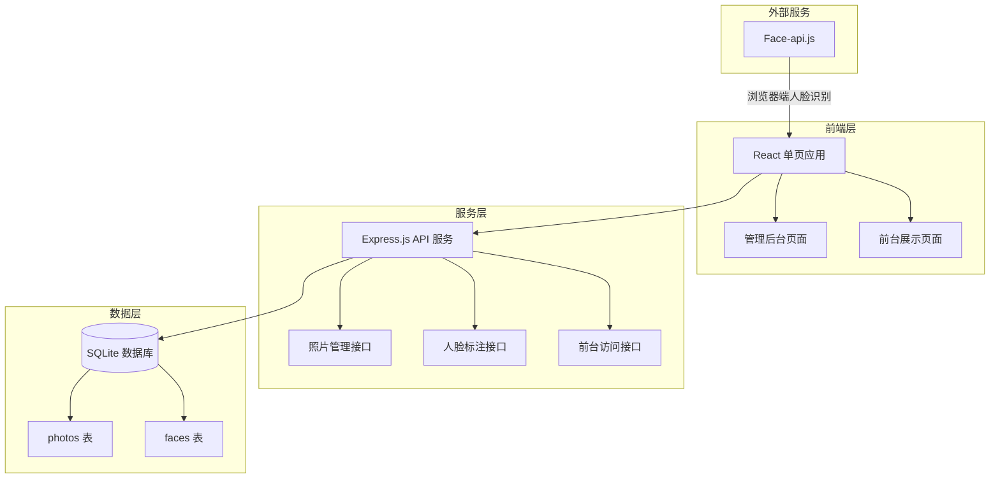
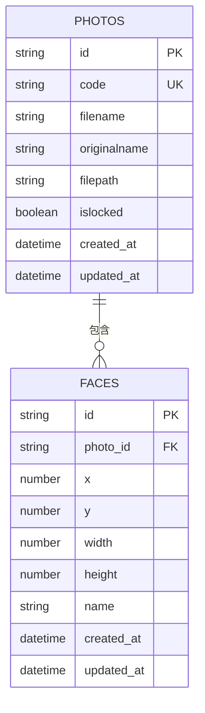

# 毕业合照人脸识别应用 技术架构

## 1. 架构设计



## 2. 技术选型

- **前端框架**：React 18 + TypeScript
- **UI 组件库**：TailwindCSS + Lucide React
- **路由管理**：React Router DOM
- **状态管理**：Zustand
- **构建工具**：Vite
- **后端框架**：Express.js 4 + TypeScript
- **数据库**：SQLite（轻量级，适合单机部署）
- **人脸识别**：face-api.js（浏览器端执行，保护隐私）

## 3. 路由定义

| 路由 | 用途 | 访问权限 |
|------|------|----------|
| `/admin` | 管理后台首页 | 管理员 |
| `/admin/upload` | 上传照片 | 管理员 |
| `/admin/photo/:id/annotate` | 人脸标注页面 | 管理员 |
| `/photo/:code` | 前台展示页 | 公开（需访问码） |

## 4. API 接口定义

### 4.1 照片管理

**POST /api/photos/upload**
- 请求：multipart/form-data，包含图片文件
- 响应：`{ id: string, code: string }`

**GET /api/photos**
- 响应：照片列表，包含状态（未标注/已标注/已锁定）

**GET /api/photos/:id**
- 响应：照片详情，包含人脸标注数据

**PUT /api/photos/:id/lock**
- 响应：更新锁定状态，生成永久访问码

### 4.2 人脸标注

**POST /api/faces**
- 请求：`{ photoId: string, x: number, y: number, width: number, height: number, name: string }`
- 响应：保存人脸标注

**PUT /api/faces/:id**
- 请求：更新人脸标注或姓名
- 响应：更新后的数据

**DELETE /api/faces/:id**
- 响应：删除人脸标注

### 4.3 前台访问

**GET /api/public/photo/:code**
- 响应：返回已锁定的照片信息和已标注的人脸数据

## 5. 数据模型

### 5.1 数据库 ER 图



### 5.2 数据定义语言

```sql
CREATE TABLE photos (
    id TEXT PRIMARY KEY,
    code TEXT UNIQUE NOT NULL,
    filename TEXT NOT NULL,
    originalname TEXT NOT NULL,
    filepath TEXT NOT NULL,
    islocked INTEGER DEFAULT 0,
    created_at DATETIME DEFAULT CURRENT_TIMESTAMP,
    updated_at DATETIME DEFAULT CURRENT_TIMESTAMP
);

CREATE TABLE faces (
    id TEXT PRIMARY KEY,
    photo_id TEXT NOT NULL,
    x REAL NOT NULL,
    y REAL NOT NULL,
    width REAL NOT NULL,
    height REAL NOT NULL,
    name TEXT NOT NULL DEFAULT '',
    created_at DATETIME DEFAULT CURRENT_TIMESTAMP,
    updated_at DATETIME DEFAULT CURRENT_TIMESTAMP,
    FOREIGN KEY (photo_id) REFERENCES photos(id) ON DELETE CASCADE
);

CREATE INDEX idx_photos_code ON photos(code);
CREATE INDEX idx_faces_photo_id ON faces(photo_id);
```

## 6. 项目结构

```
/workspace
├── src/                    # 前端源代码
│   ├── components/         # React 组件
│   ├── pages/              # 页面组件
│   ├── hooks/              # 自定义 Hooks
│   ├── stores/             # Zustand 状态管理
│   ├── utils/              # 工具函数
│   └── types/              # TypeScript 类型定义
├── api/                    # 后端 API
│   ├── routes/             # Express 路由
│   ├── services/           # 业务逻辑
│   ├── repositories/       # 数据库操作
│   ├── models/             # 数据模型
│   └── index.ts            # API 入口
├── uploads/                # 上传文件存储
├── .trae/
│   └── documents/          # 项目文档
├── package.json
├── tsconfig.json
├── vite.config.ts
└── tailwind.config.js
```

## 7. 隐私保护机制

### 7.1 随机码生成策略

```typescript
// 生成 12 位不含混淆字符的安全随机码
function generateSecureCode(): string {
    const chars = 'ABCDEFGHJKMNPQRSTUVWXYZabcdefghjkmnpqrstuvwxyz23456789';
    let code = '';
    for (let i = 0; i < 12; i++) {
        code += chars.charAt(Math.floor(Math.random() * chars.length));
    }
    return code;
}
```

### 7.2 访问控制

- 未锁定照片：仅管理员可见
- 已锁定照片：通过随机码访问，无码不可见
- 姓名数据：仅在点击头像时显示，不提供批量导出
